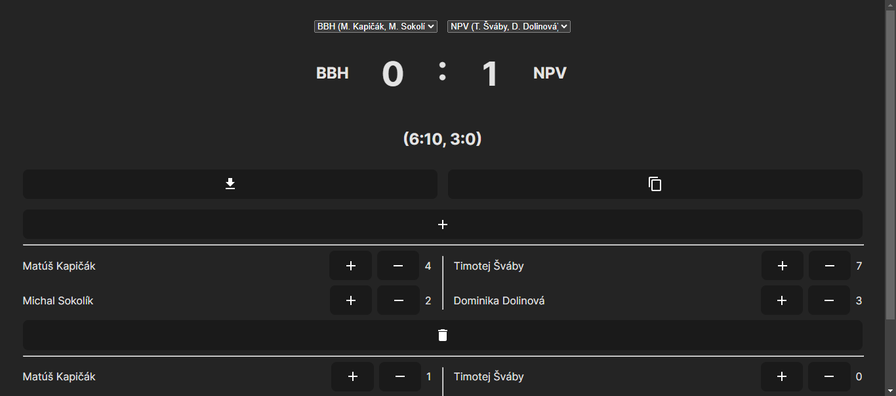

# Table Football Scoreboard App

A simple React app for managing and displaying the score for table football matches. This app provides a user-friendly interface to track periods, goals, and team scores during a table football game.

## Features
- Scoreboard Display:
   - Clear and visible representation of the current score for both home and away teams.

- Period Management:
   - Add multiple periods to keep track of the game progress.

- Player Goals:
   - Record goals scored by individual players for each team in each period.

- Snackbar Notifications:
   - Receive real-time notifications for important events or updates during the game.

## Usage

1. Setting Up:

- Clone the repository:
```
git clone https://github.com/your-username/table-football-scoreboard.git
cd table-football-scoreboard
```

2. Running the App:

- Start the React app:
```
npm install
npm start
```

3. Adding Periods:

- Click the + button to add a new period and record scores for each team.

4. Recording Goals:

- Update player goals in each period to maintain an accurate record of the game.

5. Snackbar Notifications:

- Receive notifications for successful updates or any issues during the game.

## Customization

- Team Configuration:
   - Modify the `teamHome` and `teamAway` objects in `types.ts` to customize team names and player details.

## Technologies Used

- React: The app is built using React, providing a dynamic and responsive user interface.
- Material-UI: Material-UI components enhance the visual appeal and usability of the app.

## Screenshots



## License
This project is licensed under the [MIT License](LICENSE).
